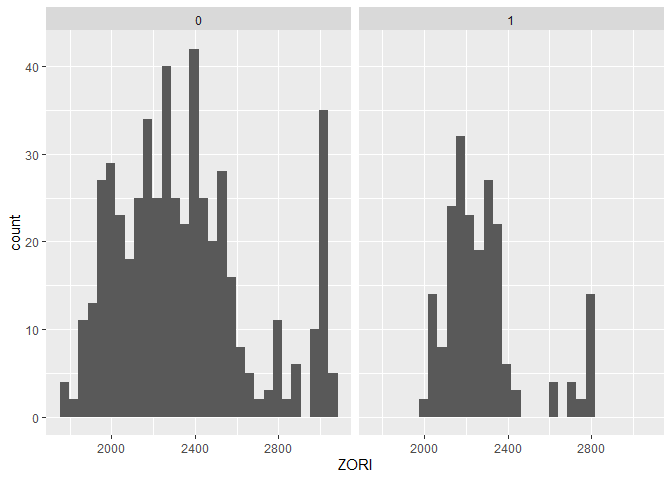
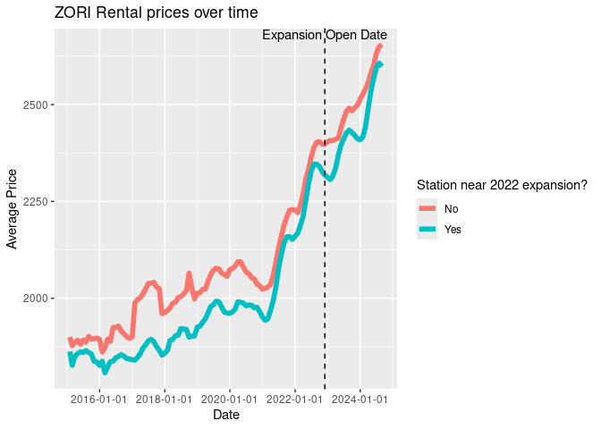

# Silver Rentals


## How did the expansion of the Silver Line of the Washington Metro System impact residential rental prices?

## Introduction:

The opening of the Silver Line of the Washington Metro System was a
major transportation expansion that aimed to improve accessibility and
connectivity between Washington, D.C., and the surrounding regions,
particularly in Northern Virginia. Transportation improvements such as
these can have significant effects on local housing markets, including
rental prices, as they increase convenience and reduce commuting times
for residents. Proximity to public transit is a desirable factor for
many renters, often leading to rental price increases in areas adjacent
to new transit lines (Peng et al., 2023).

This research seeks to analyze the rental price effects following the
expansion of the Silver Line in 2022, specifically focusing on how rents
have changed for each zip code in the Arlington, Fairfax, and Loudoun
counties. This study will provide valuable insights for urban planners
and policymakers on managing housing costs to ensure affordability in
these neighborhoods. This analysis will provide valuable insights into
how new infrastructure projects can influence housing affordability in
rapidly growing metropolitan areas, contributing to urban planning and
housing policy discussions.

## Literature Review:

There is a variety of literature about the impact that different types
of transit have on either rent prices or house prices. Peng et. al
(2024) used difference-in-difference modeling to find the change in
rental prices after the announcement of the Purple Line light rail
construction in Maryland. The two or more bedroom units saw rent
increases, however, there is no effect on the one bedroom units due to
the increasing supply and high turnover (Peng et. al., 2024). Peng and
Knaap (2023) also showed that home values increase when houses are
closer to the planned Purple Line construction. At the same time, the
home values will not increase when there is an existing metro station
near the future light rail station (Peng and Knaap, 2023). Although
these studies are noteworthy, the existing literature is not aligned
with our area of interest. Our study will only focus on how the opening
of the Silver Line extension in Northern Virginia will impact rental
prices. 

``` r
#install.packages("tidyverse")
#install.packages("kableExtra")
```

``` r
library("tidyverse")
library("kableExtra")
```

``` r
df<-read.csv("panel.csv")

df2<-df %>%
  mutate(date = as.Date(Date, format = "%Y.%m.%d"), month = month(date), year = year(date))
```

The following output is the top ten observations of our data frame.

``` r
kable(head(df2))
```

| ZIPCODE | Date | ZORI | State | CountyName | City | date | silver | post | month | year | exptime | open2014 | open2022 | openother | dist |
|---:|:---|---:|:---|:---|:---|:---|---:|---:|---:|---:|---:|---:|---:|---:|---:|
| 20120 | 2019.04.30 | 1836.296 | VA | Fairfax County | Centreville | 2019-04-30 | 0 | 0 | 4 | 2019 | 0 | 0 | 0 | 1 | 14756.27 |
| 20120 | 2019.05.31 | 1848.128 | VA | Fairfax County | Centreville | 2019-05-31 | 0 | 0 | 5 | 2019 | 0 | 0 | 0 | 1 | 14756.27 |
| 20120 | 2019.06.30 | 1844.276 | VA | Fairfax County | Centreville | 2019-06-30 | 0 | 0 | 6 | 2019 | 0 | 0 | 0 | 1 | 14756.27 |
| 20120 | 2019.07.31 | 1835.209 | VA | Fairfax County | Centreville | 2019-07-31 | 0 | 0 | 7 | 2019 | 0 | 0 | 0 | 1 | 14756.27 |
| 20120 | 2019.08.31 | 1836.571 | VA | Fairfax County | Centreville | 2019-08-31 | 0 | 0 | 8 | 2019 | 0 | 0 | 0 | 1 | 14756.27 |
| 20120 | 2019.09.30 | 1830.839 | VA | Fairfax County | Centreville | 2019-09-30 | 0 | 0 | 9 | 2019 | 0 | 0 | 0 | 1 | 14756.27 |

The frequency of this dataframe is monthly and the cross-sectional unit
is the zip code.

``` r
names(df2)
```

     [1] "ZIPCODE"    "Date"       "ZORI"       "State"      "CountyName"
     [6] "City"       "date"       "silver"     "post"       "month"     
    [11] "year"       "exptime"    "open2014"   "open2022"   "openother" 
    [16] "dist"      

The treatment variables of interest are open2022 and post. The treated
group consists of rental prices after the silver line expansion
opening(in November 2022) that are within 1.5 miles of the expansion.
The control group consists of rental prices in Fairfax and Loudoun
county that were either listed before the expansion opening or farther
than 1.5 miles from the expansion.

The outcome variable of interest is ZORI, which represents the average
price for listings.

``` r
df3 <- filter(df2, year=="2022")
ggplot(df3, aes(x=ZORI)) +
  geom_histogram() +
  facet_wrap(~open2022)
```

    `stat_bin()` using `bins = 30`. Pick better value with `binwidth`.



``` r
model1<-lm(ZORI ~ open2022*post, data=df2)

summary(model1)
```


    Call:
    lm(formula = ZORI ~ open2022 * post, data = df2)

    Residuals:
        Min      1Q  Median      3Q     Max 
    -646.86 -193.66  -42.22  144.39  972.11 

    Coefficients:
                  Estimate Std. Error t value Pr(>|t|)    
    (Intercept)   2075.458      5.027 412.878   <2e-16 ***
    open2022       -94.639      9.382 -10.087   <2e-16 ***
    post           426.789     10.430  40.918   <2e-16 ***
    open2022:post   26.430     19.566   1.351    0.177    
    ---
    Signif. codes:  0 '***' 0.001 '**' 0.01 '*' 0.05 '.' 0.1 ' ' 1

    Residual standard error: 281.1 on 5702 degrees of freedom
    Multiple R-squared:  0.3084,    Adjusted R-squared:  0.3081 
    F-statistic: 847.7 on 3 and 5702 DF,  p-value: < 2.2e-16

The predicted value of ZORI is 2075.458 with treatment=0 and 2503.247
with treatment=1.

The following is an equation that represents the above linear
regression.
$$ZORI_{i, t} = \beta_0 + \beta_1 open2022_i\times post_t + \epsilon_{i,t}$$  
Where i is zip code and t is month

$open2022$ represents zip codes that are within 1.5 miles of stations
that open in 2022.

$post$ represents opening status of the Silver Line expansion after
November 2022 and after.

$open2022 \times post$ represents zip codes that are within 1.5 miles of
stations in 2022 after its opening date.

The following equation represents the linear regression with fixed
effects included.  
$$ZORI_{i,t} = \beta_1 open2022_i \times post_t + \beta_2 open2014 + \beta_3 openother + \zeta_{month} + \theta{year}  + \lambda_{city} + \epsilon_{i,t}$$

Where $z$ represents the zip code and $m$ represents the current month
$$ZORI = \beta_0 + \beta_1 open2022:post+ \beta_2 city + \beta_3 zip\_code + \beta_4 month + \beta_5 year + \epsilon$$

``` r
model2 <- lm(ZORI ~ open2022 + post + open2022:post + open2014 + openother + as.factor(month) + as.factor(year) + as.factor(City) + as.factor(CountyName), data=df)

df5 <- df %>% mutate(time=(round(interval(as.Date("2022-11-30"), date)/months(1)))) %>%
    mutate (post_12m_before = (time >= -12 & time < -6)) %>% 
    mutate (post_6m_before = (time >= -6 & time < 0)) %>% 
    mutate(post_6m_after = (time <= 6 & time > 0)) %>% 
    mutate(post_12m_after = (time <= 12 & time > 6))

model3 <- lm(ZORI ~ dist + post + dist:post + open2014 + openother + as.factor(month) + as.factor(year) + as.factor(City) + as.factor(CountyName), data=df5)

model4 <- lm(ZORI ~ open2022*post + open2022*post_12m_before + open2022*post_6m_before + open2022*post_6m_after  + open2022*post_12m_after + open2014 + openother + as.factor(month) + as.factor(year) + as.factor(City) + as.factor(CountyName), data=df5)
model5 <- lm(ZORI ~ dist*post + dist*post_12m_before + dist*post_6m_before + dist*post_6m_after  + dist*post_12m_after + open2014 + openother + as.factor(month) + as.factor(year) + as.factor(City) + as.factor(CountyName), data=df5)
#summary(model2)
summary(model5)
```


    Call:
    lm(formula = ZORI ~ dist * post + dist * post_12m_before + dist * 
        post_6m_before + dist * post_6m_after + dist * post_12m_after + 
        open2014 + openother + as.factor(month) + as.factor(year) + 
        as.factor(City) + as.factor(CountyName), data = df5)

    Residuals:
        Min      1Q  Median      3Q     Max 
    -540.03  -51.81    0.60   58.47  359.98 

    Coefficients: (1 not defined because of singularities)
                                          Estimate Std. Error t value Pr(>|t|)    
    (Intercept)                          2.714e+03  2.778e+01  97.699  < 2e-16 ***
    dist                                -3.383e-02  1.411e-03 -23.979  < 2e-16 ***
    post                                 2.170e+02  2.143e+01  10.129  < 2e-16 ***
    post_12m_beforeTRUE                  1.002e+02  1.347e+01   7.438 1.18e-13 ***
    post_6m_beforeTRUE                   1.832e+02  1.661e+01  11.032  < 2e-16 ***
    post_6m_afterTRUE                   -3.083e+01  1.466e+01  -2.103 0.035494 *  
    post_12m_afterTRUE                  -3.918e+00  1.534e+01  -0.255 0.798423    
    open2014                            -8.463e+00  8.597e+00  -0.984 0.324963    
    openother                           -6.253e+01  1.077e+01  -5.805 6.78e-09 ***
    as.factor(month)2                    8.941e+00  6.967e+00   1.283 0.199443    
    as.factor(month)3                    2.199e+01  6.950e+00   3.164 0.001567 ** 
    as.factor(month)4                    3.885e+01  6.940e+00   5.597 2.28e-08 ***
    as.factor(month)5                    4.783e+01  7.048e+00   6.786 1.27e-11 ***
    as.factor(month)6                    6.174e+01  7.153e+00   8.631  < 2e-16 ***
    as.factor(month)7                    7.375e+01  7.153e+00  10.311  < 2e-16 ***
    as.factor(month)8                    7.859e+01  7.153e+00  10.986  < 2e-16 ***
    as.factor(month)9                    7.220e+01  7.455e+00   9.686  < 2e-16 ***
    as.factor(month)10                   6.990e+01  7.427e+00   9.412  < 2e-16 ***
    as.factor(month)11                   4.543e+01  7.887e+00   5.761 8.83e-09 ***
    as.factor(month)12                   5.299e+01  7.702e+00   6.881 6.60e-12 ***
    as.factor(year)2016                  2.445e+01  8.640e+00   2.830 0.004676 ** 
    as.factor(year)2017                  5.656e+01  8.335e+00   6.786 1.27e-11 ***
    as.factor(year)2018                  1.076e+02  8.189e+00  13.142  < 2e-16 ***
    as.factor(year)2019                  1.693e+02  8.112e+00  20.870  < 2e-16 ***
    as.factor(year)2020                  1.797e+02  8.072e+00  22.261  < 2e-16 ***
    as.factor(year)2021                  2.373e+02  8.263e+00  28.714  < 2e-16 ***
    as.factor(year)2022                  3.045e+02  1.583e+01  19.234  < 2e-16 ***
    as.factor(year)2023                  3.717e+02  2.113e+01  17.596  < 2e-16 ***
    as.factor(year)2024                  4.919e+02  2.296e+01  21.425  < 2e-16 ***
    as.factor(City)Annandale            -6.219e+02  1.854e+01 -33.548  < 2e-16 ***
    as.factor(City)Ashburn              -6.332e+02  2.220e+01 -28.526  < 2e-16 ***
    as.factor(City)Centreville          -4.650e+02  1.339e+01 -34.727  < 2e-16 ***
    as.factor(City)Fairfax              -6.221e+02  1.479e+01 -42.063  < 2e-16 ***
    as.factor(City)Falls Church         -7.691e+02  2.327e+01 -33.048  < 2e-16 ***
    as.factor(City)Herndon              -9.251e+02  2.247e+01 -41.171  < 2e-16 ***
    as.factor(City)Huntington           -7.580e+02  1.342e+01 -56.491  < 2e-16 ***
    as.factor(City)Hybla Valley         -5.654e+02  1.645e+01 -34.370  < 2e-16 ***
    as.factor(City)Leesburg             -6.130e+02  1.611e+01 -38.045  < 2e-16 ***
    as.factor(City)Lincolnia            -7.908e+02  2.041e+01 -38.751  < 2e-16 ***
    as.factor(City)Lorton                8.638e+01  2.283e+01   3.784 0.000156 ***
    as.factor(City)McLean               -6.676e+02  2.164e+01 -30.856  < 2e-16 ***
    as.factor(City)Reston               -9.187e+02  2.362e+01 -38.888  < 2e-16 ***
    as.factor(City)Rose Hill            -3.612e+02  1.252e+01 -28.845  < 2e-16 ***
    as.factor(City)Springfield           2.979e+02  1.893e+01  15.740  < 2e-16 ***
    as.factor(City)Sterling             -8.255e+02  2.673e+01 -30.880  < 2e-16 ***
    as.factor(City)Vienna               -2.647e+02  2.427e+01 -10.909  < 2e-16 ***
    as.factor(CountyName)Loudoun County         NA         NA      NA       NA    
    dist:post                            1.569e-03  7.493e-04   2.094 0.036319 *  
    dist:post_12m_beforeTRUE             9.929e-04  9.348e-04   1.062 0.288212    
    dist:post_6m_beforeTRUE             -3.316e-04  9.348e-04  -0.355 0.722771    
    dist:post_6m_afterTRUE              -1.138e-03  1.118e-03  -1.018 0.308784    
    dist:post_12m_afterTRUE             -1.437e-03  1.118e-03  -1.285 0.198741    
    ---
    Signif. codes:  0 '***' 0.001 '**' 0.01 '*' 0.05 '.' 0.1 ' ' 1

    Residual standard error: 108.1 on 5655 degrees of freedom
    Multiple R-squared:  0.8986,    Adjusted R-squared:  0.8977 
    F-statistic:  1003 on 50 and 5655 DF,  p-value: < 2.2e-16

When fixed effects are included, the silver line’s effect jumps from 188
to 630.

``` r
df6 <- df %>%
  group_by(date, open2022) %>%
  summarise(avgPrice = mean(ZORI)) %>%
  mutate(date = as.Date(date)) %>%
  mutate(open2022 = ifelse(open2022==1, "Yes", "No"))
```

    `summarise()` has grouped output by 'date'. You can override using the
    `.groups` argument.

``` r
opening_date <- as.Date("2022-11-30")

ggplot(df6, aes(x = date, y = avgPrice, color=factor(open2022))) +
  geom_line(linewidth=2) + 
  geom_vline(xintercept = as.numeric(opening_date), linetype = "dashed", color = "black") + 
  annotate("text", x = opening_date, y = max(df6$avgPrice), label = "Expansion Open Date", vjust = -0.5, color = "Black") +
  scale_x_date(date_labels = "%Y-%m-%d", date_breaks = "2 years") +
  labs(title = "ZORI Rental prices over time",
       x = "Date", 
       y = "Average Price",
       color = "Station near 2022 expansion?")
```



# Questions for Week 5

library(“fixest”)

model2 \<- feols(ZORI ~ open2022 + post + open2022:post + open2014 +
openother \| month + year + City, data=df2)

model3 \<- feols(ZORI ~ open2022 + post + open2022:post \| Date +
ZIPCODE, data=df2)

model4 \<- feols(ZORI ~ open2022 + post + open2022:post + open2014 +
openother \| Date + City, data=df2)

summary(model2) summary(model3) summary(model4) \`\`\`

Possible explanations why rents do not change:

- High turnover of renters

- Higher supply

- More people buy houses rather than rent

- Cost of rent is already high because of other businesses near the
  metro station

Step 9: Change the document format to gfm

Step 10: Save this document as README.qmd

Step 11: Render the document. README.md file should be created after
this process.

Step 12: Push the document back to GitHub and observe your beautiful
document in your repository!

Step 13: If your team has a complete dataframe that includes both the
treated and outcome variable, you are done with the assignment. If not,
make a research plan in Notion to collect data on the outcome and
treatment variable and combine it into one dataframe.

## Future Plans:

The house rental prices may not have adjusted immediately as the
expansion of the silver line opened. As such, including the time since
the expansion opened may help us better understand the silver line’s
effects on rental prices.

## References:

Peng, Q., & Knaap, G. (2023). When and Where Do Home Values Increase in
Response to Planned Light Rail Construction?. *Journal of Planning
Education and Research*, 0739456X221133022.

Peng, Q., Knaap, G. J., & Finio, N. (2024). Do Multifamily unit Rents
Increase in Response to Light Rail in the Pre-service Period?.
*International Regional Science Review*, 47(5-6), 566-590.
