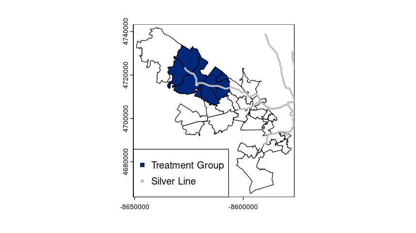
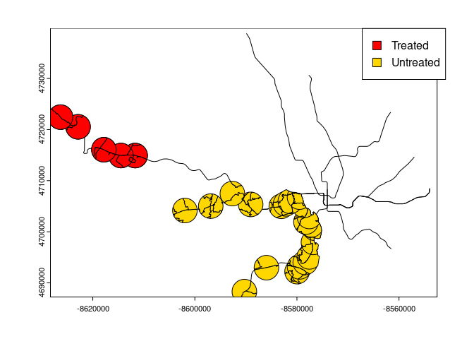

# Silver Rentals

## How did the expansion of the Silver Line of the Washington Metro System impact residential rental prices?

## Introduction

The opening of the Silver Line of the Washington Metro System was a major transportation expansion that aimed to improve accessibility and connectivity between Washington, D.C., and the surrounding regions, particularly in Northern Virginia. Transportation improvements such as these can have significant effects on local housing markets, including rental prices, as they increase convenience and reduce commuting times for residents. Proximity to public transit is a desirable factor for many renters, often leading to rental price increases in areas adjacent to new transit lines (Peng et al., 2023).

This research seeks to analyze the rental price effects following the expansion of the Silver Line in 2022, specifically focusing on how rents have changed for each zip code in the Arlington, Fairfax, and Loudoun counties. This study will provide valuable insights for urban planners and policymakers on managing housing costs to ensure affordability in these neighborhoods. This analysis will provide valuable insights into how new infrastructure projects can influence housing affordability in rapidly growing metropolitan areas, contributing to urban planning and housing policy discussions.

## Literature Review

There is a variety of literature about the impact that different types of transit have on either rent prices or house prices. Peng et. al (2024) used difference-in-difference modeling to find the change in rental prices after the announcement of the Purple Line light rail construction in Maryland. The two or more bedroom units saw rent increases, however, there is no effect on the one bedroom units due to the increasing supply and high turnover (Peng et al., 2024). Peng and Knaap (2023) also showed that home values increase when houses are closer to the planned Purple Line construction. At the same time, the home values will not increase when there is an existing metro station near the future light rail station (Peng and Knaap, 2023). Although these studies are noteworthy, the existing literature is not aligned with our area of interest. Our study will only focus on how the opening of the Silver Line extension in Northern Virginia will impact rental prices.

## Data Description

``` r
# install.packages("tidyverse")
# install.packages("kableExtra")
```

``` r
library("terra")
library("tidyverse")
library("kableExtra")
```

``` r
df<-read.csv("panel.csv")

df2<-df %>%
  mutate(date = as.Date(Date, format = "%Y.%m.%d"), month = month(date), year = year(date))
```

The following output is the top ten observations of our data frame.

``` r
kable(head(df2))
```

| ZIPCODE | Date       |     ZORI | State | CountyName     | City        | date       | silver | post | month | year | exptime | open2014 | open2022 | openother |     dist |
|--------:|:-----------|---------:|:------|:---------------|:------------|:-----------|-------:|-----:|------:|-----:|--------:|---------:|---------:|----------:|---------:|
|   20120 | 2019.04.30 | 1836.296 | VA    | Fairfax County | Centreville | 2019-04-30 |      0 |    0 |     4 | 2019 |       0 |        0 |        0 |         1 | 14756.27 |
|   20120 | 2019.05.31 | 1848.128 | VA    | Fairfax County | Centreville | 2019-05-31 |      0 |    0 |     5 | 2019 |       0 |        0 |        0 |         1 | 14756.27 |
|   20120 | 2019.06.30 | 1844.276 | VA    | Fairfax County | Centreville | 2019-06-30 |      0 |    0 |     6 | 2019 |       0 |        0 |        0 |         1 | 14756.27 |
|   20120 | 2019.07.31 | 1835.209 | VA    | Fairfax County | Centreville | 2019-07-31 |      0 |    0 |     7 | 2019 |       0 |        0 |        0 |         1 | 14756.27 |
|   20120 | 2019.08.31 | 1836.571 | VA    | Fairfax County | Centreville | 2019-08-31 |      0 |    0 |     8 | 2019 |       0 |        0 |        0 |         1 | 14756.27 |
|   20120 | 2019.09.30 | 1830.839 | VA    | Fairfax County | Centreville | 2019-09-30 |      0 |    0 |     9 | 2019 |       0 |        0 |        0 |         1 | 14756.27 |

For this dataframe, as well as our treatment and outcome variables, the frequency is monthly and the geographical unit is the zip code.

``` r
names(df2)
```

```         
 [1] "ZIPCODE"    "Date"       "ZORI"       "State"      "CountyName"
 [6] "City"       "date"       "silver"     "post"       "month"     
[11] "year"       "exptime"    "open2014"   "open2022"   "openother" 
[16] "dist"      
```

The treatment variables of interest are open2022 and post. The treated group consists of rental prices after the Silver Line expansion opening (in November 2022) that are within 1.5 miles of the expansion. The control group consists of rental prices in Fairfax and Loudoun county that were either listed before the expansion opening or farther than 1.5 miles from the expansion.

The outcome variable of interest is ZORI, which represents the average price for listings.

## Methodology and Data Visualization



## 

``` r
df3 <- filter(df2, year=="2022")
ggplot(df3, aes(x=ZORI)) +
  geom_histogram() +
  facet_wrap(~open2022)
```


``` r
model1<-lm(ZORI ~ open2022*post, data=df2)

summary(model1)
```

```         
Call:
lm(formula = ZORI ~ open2022 * post, data = df2)

Residuals:
    Min      1Q  Median      3Q     Max 
-646.86 -193.66  -42.22  144.39  972.11 

Coefficients:
              Estimate Std. Error t value Pr(>|t|)    
(Intercept)   2075.458      5.027 412.878   <2e-16 ***
open2022       -94.639      9.382 -10.087   <2e-16 ***
post           426.789     10.430  40.918   <2e-16 ***
open2022:post   26.430     19.566   1.351    0.177    
---
Signif. codes:  0 '***' 0.001 '**' 0.01 '*' 0.05 '.' 0.1 ' ' 1

Residual standard error: 281.1 on 5702 degrees of freedom
Multiple R-squared:  0.3084,    Adjusted R-squared:  0.3081 
F-statistic: 847.7 on 3 and 5702 DF,  p-value: < 2.2e-16
```

The predicted value of ZORI is 2075.458 with treatment=0 and 2503.247 with treatment=1.

## Equation

The following is an equation that represents the above linear regression. $$ZORI_{i, t} = \beta_0 + \beta_1 open2022_i\times post_t + \epsilon_{i,t}$$\
Where i is zip code and t is month

$open2022$ represents zip codes that are within 1.5 miles of stations that open in 2022.

$post$ represents opening status of the Silver Line expansion after November 2022 and after.

$open2022 \times post$ represents zip codes that are within 1.5 miles of stations in 2022 after its opening date.

The following equation represents the linear regression with fixed effects included.\
$$ZORI_{i,t} = \beta_1 open2022_i \times post_t + \beta_2 open2014 + \beta_3 openother + \zeta_{month} + \theta{year}  + \lambda_{city} + \epsilon_{i,t}$$

Where $z$ represents the zip code and $m$ represents the current month $$ZORI = \beta_0 + \beta_1 open2022:post+ \beta_2 city + \beta_3 zip\_code + \beta_4 month + \beta_5 year + \epsilon$$

## Results

``` r
model2 <- lm(ZORI ~ open2022 + post + open2022:post + open2014 + openother + as.factor(month) + as.factor(year) + as.factor(City) + as.factor(CountyName), data=df)

df5 <- df %>% mutate(time=(round(interval(as.Date("2022-11-30"), date)/months(1)))) %>%
    mutate (post_12m_before = (time >= -12 & time < -6)) %>% 
    mutate (post_6m_before = (time >= -6 & time < 0)) %>% 
    mutate(post_6m_after = (time <= 6 & time > 0)) %>% 
    mutate(post_12m_after = (time <= 12 & time > 6))

model3 <- lm(ZORI ~ dist + post + dist:post + open2014 + openother + as.factor(month) + as.factor(year) + as.factor(City) + as.factor(CountyName), data=df5)

model4 <- lm(ZORI ~ open2022*post + open2022*post_12m_before + open2022*post_6m_before + open2022*post_6m_after  + open2022*post_12m_after + open2014 + openother + as.factor(month) + as.factor(year) + as.factor(City) + as.factor(CountyName), data=df5)
model5 <- lm(ZORI ~ dist*post + dist*post_12m_before + dist*post_6m_before + dist*post_6m_after  + dist*post_12m_after + open2014 + openother + as.factor(month) + as.factor(year) + as.factor(City) + as.factor(CountyName), data=df5)
summary(model2)
```

```         
Call:
lm(formula = ZORI ~ open2022 + post + open2022:post + open2014 + 
    openother + as.factor(month) + as.factor(year) + as.factor(City) + 
    as.factor(CountyName), data = df)

Residuals:
    Min      1Q  Median      3Q     Max 
-554.93  -52.78    0.45   63.38  379.84 

Coefficients: (2 not defined because of singularities)
                                     Estimate Std. Error t value Pr(>|t|)    
(Intercept)                         2050.0102    13.5937 150.806  < 2e-16 ***
open2022                             117.3114    11.3265  10.357  < 2e-16 ***
post                                  37.8397    12.5583   3.013 0.002597 ** 
open2014                             114.4929     6.4692  17.698  < 2e-16 ***
openother                                  NA         NA      NA       NA    
as.factor(month)2                      9.4207     7.3976   1.273 0.202899    
as.factor(month)3                     22.4398     7.3796   3.041 0.002370 ** 
as.factor(month)4                     39.1769     7.3690   5.316 1.10e-07 ***
as.factor(month)5                     57.2347     7.3726   7.763 9.76e-15 ***
as.factor(month)6                     73.9859     7.3690  10.040  < 2e-16 ***
as.factor(month)7                     85.9968     7.3690  11.670  < 2e-16 ***
as.factor(month)8                     90.8295     7.3690  12.326  < 2e-16 ***
as.factor(month)9                     85.3816     7.6620  11.143  < 2e-16 ***
as.factor(month)10                    82.2990     7.6349  10.779  < 2e-16 ***
as.factor(month)11                    73.2206     7.8224   9.360  < 2e-16 ***
as.factor(month)12                    77.9143     7.7975   9.992  < 2e-16 ***
as.factor(year)2016                   33.5335     9.1658   3.659 0.000256 ***
as.factor(year)2017                   64.8472     8.8471   7.330 2.63e-13 ***
as.factor(year)2018                  108.4561     8.7030  12.462  < 2e-16 ***
as.factor(year)2019                  168.2627     8.6231  19.513  < 2e-16 ***
as.factor(year)2020                  176.1281     8.5779  20.533  < 2e-16 ***
as.factor(year)2021                  251.0270     8.5134  29.486  < 2e-16 ***
as.factor(year)2022                  454.5293     8.7476  51.960  < 2e-16 ***
as.factor(year)2023                  533.9628    14.9964  35.606  < 2e-16 ***
as.factor(year)2024                  681.6147    15.5678  43.784  < 2e-16 ***
as.factor(City)Annandale            -366.9491    16.1533 -22.717  < 2e-16 ***
as.factor(City)Ashburn              -248.0116    16.3393 -15.179  < 2e-16 ***
as.factor(City)Centreville          -429.5767    14.1045 -30.457  < 2e-16 ***
as.factor(City)Fairfax              -395.0243    12.1015 -32.642  < 2e-16 ***
as.factor(City)Falls Church         -273.6458    11.5581 -23.676  < 2e-16 ***
as.factor(City)Herndon              -528.3722    16.2190 -32.577  < 2e-16 ***
as.factor(City)Huntington           -602.5012    12.4746 -48.298  < 2e-16 ***
as.factor(City)Hybla Valley         -576.2849    17.4260 -33.070  < 2e-16 ***
as.factor(City)Leesburg             -478.9467    16.0539 -29.834  < 2e-16 ***
as.factor(City)Lincolnia            -501.3105    17.5066 -28.635  < 2e-16 ***
as.factor(City)Lorton               -336.1865    15.5150 -21.669  < 2e-16 ***
as.factor(City)McLean               -246.9311    13.5549 -18.217  < 2e-16 ***
as.factor(City)Reston               -455.6560    14.5726 -31.268  < 2e-16 ***
as.factor(City)Rose Hill            -227.6935    11.9220 -19.099  < 2e-16 ***
as.factor(City)Springfield           160.0667    18.9879   8.430  < 2e-16 ***
as.factor(City)Sterling             -340.8878    18.7160 -18.214  < 2e-16 ***
as.factor(City)Vienna                244.4574    12.6410  19.338  < 2e-16 ***
as.factor(CountyName)Loudoun County        NA         NA      NA       NA    
open2022:post                          0.5522     8.1395   0.068 0.945912    
---
Signif. codes:  0 '***' 0.001 '**' 0.01 '*' 0.05 '.' 0.1 ' ' 1

Residual standard error: 114.7 on 5664 degrees of freedom
Multiple R-squared:  0.8855,    Adjusted R-squared:  0.8847 
F-statistic:  1069 on 41 and 5664 DF,  p-value: < 2.2e-16
```

``` r
summary(model4)
```

```         
Call:
lm(formula = ZORI ~ open2022 * post + open2022 * post_12m_before + 
    open2022 * post_6m_before + open2022 * post_6m_after + open2022 * 
    post_12m_after + open2014 + openother + as.factor(month) + 
    as.factor(year) + as.factor(City) + as.factor(CountyName), 
    data = df5)

Residuals:
    Min      1Q  Median      3Q     Max 
-560.42  -49.17    1.37   60.50  379.12 

Coefficients: (2 not defined because of singularities)
                                    Estimate Std. Error t value Pr(>|t|)    
(Intercept)                         2061.973     13.510 152.621  < 2e-16 ***
open2022                             114.305     11.330  10.089  < 2e-16 ***
post                                 228.778     22.049  10.376  < 2e-16 ***
post_12m_beforeTRUE                  104.387     13.047   8.001 1.49e-15 ***
post_6m_beforeTRUE                   176.056     16.564  10.629  < 2e-16 ***
post_6m_afterTRUE                    -37.429     13.980  -2.677 0.007443 ** 
post_12m_afterTRUE                   -15.355     14.763  -1.040 0.298327    
open2014                             114.124      6.398  17.838  < 2e-16 ***
openother                                 NA         NA      NA       NA    
as.factor(month)2                      9.034      7.316   1.235 0.216891    
as.factor(month)3                     22.081      7.298   3.026 0.002491 ** 
as.factor(month)4                     38.791      7.287   5.323 1.06e-07 ***
as.factor(month)5                     47.864      7.401   6.468 1.08e-10 ***
as.factor(month)6                     61.592      7.511   8.200 2.94e-16 ***
as.factor(month)7                     73.603      7.511   9.799  < 2e-16 ***
as.factor(month)8                     78.436      7.511  10.443  < 2e-16 ***
as.factor(month)9                     72.096      7.827   9.211  < 2e-16 ***
as.factor(month)10                    69.030      7.798   8.852  < 2e-16 ***
as.factor(month)11                    43.876      8.281   5.298 1.21e-07 ***
as.factor(month)12                    52.195      8.087   6.454 1.18e-10 ***
as.factor(year)2016                   33.471      9.065   3.692 0.000224 ***
as.factor(year)2017                   64.666      8.754   7.387 1.72e-13 ***
as.factor(year)2018                  107.699      8.614  12.503  < 2e-16 ***
as.factor(year)2019                  167.406      8.537  19.609  < 2e-16 ***
as.factor(year)2020                  175.265      8.494  20.634  < 2e-16 ***
as.factor(year)2021                  232.291      8.684  26.750  < 2e-16 ***
as.factor(year)2022                  298.320     16.627  17.942  < 2e-16 ***
as.factor(year)2023                  364.712     22.183  16.441  < 2e-16 ***
as.factor(year)2024                  484.134     24.107  20.083  < 2e-16 ***
as.factor(City)Annandale            -366.383     15.975 -22.935  < 2e-16 ***
as.factor(City)Ashburn              -247.311     16.160 -15.304  < 2e-16 ***
as.factor(City)Centreville          -428.957     13.950 -30.750  < 2e-16 ***
as.factor(City)Fairfax              -394.855     11.967 -32.994  < 2e-16 ***
as.factor(City)Falls Church         -273.194     11.431 -23.899  < 2e-16 ***
as.factor(City)Herndon              -527.693     16.040 -32.899  < 2e-16 ***
as.factor(City)Huntington           -601.646     12.338 -48.763  < 2e-16 ***
as.factor(City)Hybla Valley         -575.176     17.235 -33.372  < 2e-16 ***
as.factor(City)Leesburg             -478.645     15.876 -30.148  < 2e-16 ***
as.factor(City)Lincolnia            -500.448     17.315 -28.902  < 2e-16 ***
as.factor(City)Lorton               -336.050     15.343 -21.903  < 2e-16 ***
as.factor(City)McLean               -246.562     13.405 -18.394  < 2e-16 ***
as.factor(City)Reston               -455.235     14.411 -31.590  < 2e-16 ***
as.factor(City)Rose Hill            -227.596     11.790 -19.305  < 2e-16 ***
as.factor(City)Springfield           161.377     18.784   8.591  < 2e-16 ***
as.factor(City)Sterling             -343.324     18.576 -18.482  < 2e-16 ***
as.factor(City)Vienna                245.125     12.503  19.606  < 2e-16 ***
as.factor(CountyName)Loudoun County       NA         NA      NA       NA    
open2022:post                          4.464     11.241   0.397 0.691279    
open2022:post_12m_beforeTRUE          11.627     14.029   0.829 0.407281    
open2022:post_6m_beforeTRUE           20.778     14.029   1.481 0.138660    
open2022:post_6m_afterTRUE            -6.956     16.788  -0.414 0.678635    
open2022:post_12m_afterTRUE            4.789     16.788   0.285 0.775430    
---
Signif. codes:  0 '***' 0.001 '**' 0.01 '*' 0.05 '.' 0.1 ' ' 1

Residual standard error: 113.5 on 5656 degrees of freedom
Multiple R-squared:  0.8882,    Adjusted R-squared:  0.8872 
F-statistic: 917.2 on 49 and 5656 DF,  p-value: < 2.2e-16
```

When fixed effects are included, the silver line’s effect jumps from 188 to 630.

## Plot

``` r
df6 <- df %>%
  group_by(date, open2022) %>%
  summarise(avgPrice = mean(ZORI)) %>%
  mutate(date = as.Date(date)) %>%
  mutate(open2022 = ifelse(open2022==1, "Yes", "No"))
```

``` r
opening_date <- as.Date("2022-11-30")

ggplot(df6, aes(x = date, y = avgPrice, color=factor(open2022))) +
  geom_line(linewidth=2) + 
  geom_vline(xintercept = as.numeric(opening_date), linetype = "dashed", color = "black") + 
  annotate("text", x = opening_date, y = max(df6$avgPrice), label = "Expansion Open Date", vjust = -0.5, color = "Black") +
  scale_x_date(date_labels = "%Y-%m-%d", date_breaks = "2 years") +
  labs(title = "ZORI Rental prices over time",
       x = "Date", 
       y = "Average Price",
       color = "Station near 2022 expansion?")
```


``` r
# Map of the treated and untreated group

metro<-vect("Metro_Stations_Regional/Metro_Stations_Regional.shp")
line<-vect("Metro_Lines_Regional/Metro_Lines_Regional.shp")

metrodf<-as.data.frame(metro)

treated<-c("Ashburn", "Loudoun Gateway", "Dulles International Airport", 
       "Innovation Center", "Herndon", "Reston Town Center")
untreated<-c("Vienna/Fairfax-GMU", "Dunn Loring-Merrifield", "West Falls Church",
       "East Falls Church", "Ballston MU", "Virginia Square-GMU", "Clarendon",
       "Court House", "Rosslyn", "Arlington Cemetery", "Pentagon", "Pentagon City",
       "Crystal City", "Ronald Reagan Washington National Airport", "Potomac Yard",
       "Braddock Road", "King St-Old Town", "Eisenhower Ave", "Huntington",
       "Van Dorn Street", "Franconia-Springfield")

silver_2022 <- buffer(subset(metro, metro$NAME %in% treated), width=2414)
other_stations <- buffer(subset(metro, metro$NAME %in% untreated), width=2414)

# Project zip codes in the treated stations buffer
va2 <- vect("VA/VA_Zip_Codes.shp")
va_project2 <- project(va2, crs(metro))
va_project2 <- terra::makeValid(va_project2)
va_2022 <- terra::intersect(va_project2, silver_2022)
va_2022_df <- as.data.frame(va_2022) |>
  select(ZIP_CODE) |>
  rename(ZIPCODE = ZIP_CODE) |>
  mutate(open = 2022)

# Project zip codes in the untreated stations buffer
va3 <- vect("VA/VA_Zip_Codes.shp")
va_project3 <- project(va3, crs(metro))
va_project3 <- terra::makeValid(va_project3)
other_zips <- terra::intersect(va_project3, other_stations)
other_zips_df <- as.data.frame(other_zips) |>
  select(ZIP_CODE) |>
  rename(ZIPCODE = ZIP_CODE) |>
  mutate(open = "other_stations")

# Create the overlay
plot(line)
plot(silver_2022, col="red", add=TRUE)
plot(va_2022, col="red", add=TRUE)
plot(other_zips, col="gold", add=TRUE)

legend("topright", legend=c("Treated", "Untreated"), fill=c("red", "gold"), border="black", xpd = TRUE)
```



## Discussion

After accounting for fixed effects in our regression analysis, we can see that the 2022 expansion of the Silver Line did not have a significant effect on rent prices. Rental units listed after the expansion and within 1.5 miles of it did not increase nor decrease in their price more quickly compared to other units. This may contradict the research from Peng et al. (2024), which found that after the Purple Line was announced, units with two bedrooms had more of an increase, while units with one bedroom did not see an effect.

Possible reasons for this lack of an impact may include a high turnover of renters, high supply of rental units, a shift toward people buying houses rather than renting, and other external factors, such as the pandemic. Additionally, rental prices may not have adjusted immediately as the expansion of the Silver Line opened. As such, incorporating the time since the expansion opened in our analysis may help us better understand the Silver Line’s effects on rental prices.

## Future Plans
In the future, we can expand upon our research by:
-   Examining one-bedroom and multi-bedroom unit rental prices separately.
-   Taking into account the influence of outside factors, such as the pandemic.
-   Examining the time since the expansion opened more closely in our analysis.

## Bibliography
Peng, Q., & Knaap, G. (2023). When and Where Do Home Values Increase in Response to Planned Light Rail Construction?. *Journal of Planning Education and Research*, 0739456X221133022.

Peng, Q., Knaap, G. J., & Finio, N. (2024). Do Multifamily unit Rents Increase in Response to Light Rail in the Pre-service Period?. *International Regional Science Review*, *47*(5-6), 566-590.
